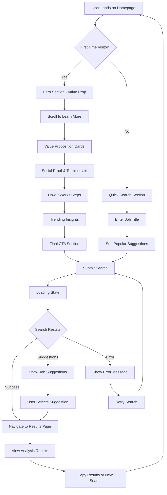
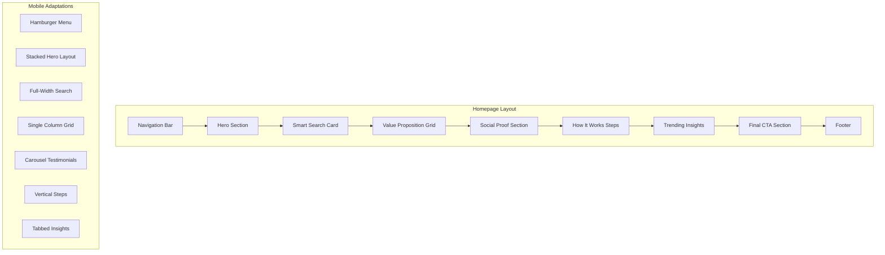
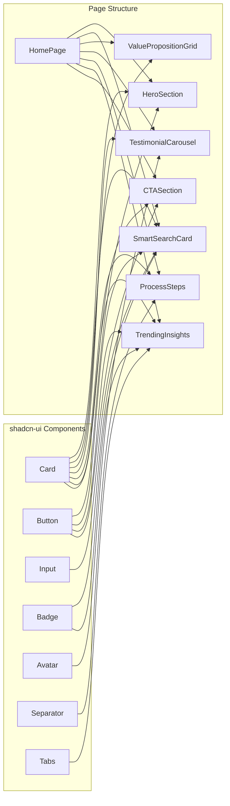
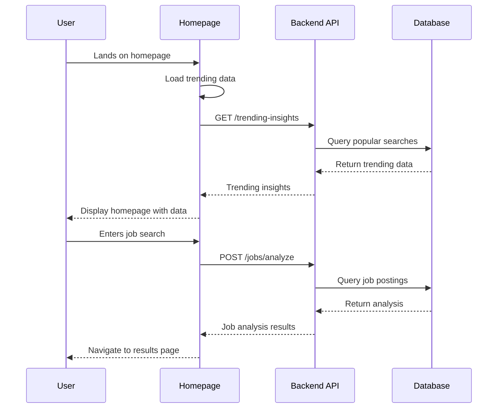
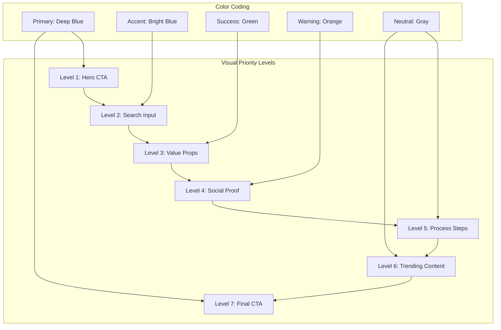

# Homepage User Flow & Structure Diagram

## 🔄 User Journey Flow



## 📱 Homepage Layout Structure



## 🎯 Conversion Funnel

```mermaid
funnel
    title Homepage Conversion Funnel
    "Homepage Visitors" : 1000
    "Engage with Content" : 750
    "View Value Props" : 600
    "Interact with Search" : 450
    "Complete Search" : 380
    "View Results" : 320
    "Return Users" : 80
```

## 🧩 Component Hierarchy



## 📊 Data Flow Architecture



## 🎨 Visual Hierarchy Map



## 🔄 State Management Flow

```mermaid
stateDiagram-v2
    [*] --> Loading
    Loading --> Loaded
    Loaded --> Searching
    Searching --> SearchSuccess
    Searching --> SearchError
    Searching --> SearchSuggestions
    
    SearchSuccess --> ResultsPage
    SearchError --> Loaded
    SearchSuggestions --> Searching
    
    ResultsPage --> NewSearch
    NewSearch --> Loaded
    
    Loaded --> InteractingWithContent
    InteractingWithContent --> Loaded
    InteractingWithContent --> Searching