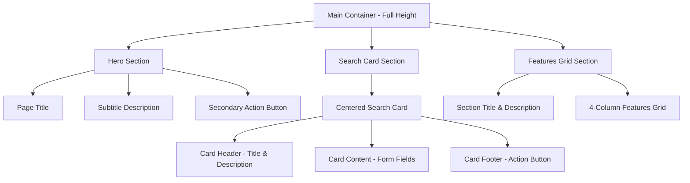

# Homepage UI Architecture Design

## Overview

This document outlines the new UI architecture for the application's homepage ([`frontend/src/app/page.tsx`](frontend/src/app/page.tsx)), transitioning from a dark-themed custom design to a modern, clean, and professional light-themed interface using shadcn/ui components and best practices.

## Current State Analysis

The existing homepage currently features:
- Dark theme (slate-900 background) with gradient text effects
- Complex form layout with inline labels and custom styling
- Manual SVG icons embedded in the code
- Custom CSS styling that overrides shadcn/ui defaults
- Features section using custom card styling
- 289 lines of code with mixed styling approaches

## Proposed New Architecture

### 1. Layout and Structure

The new design follows a clean, three-section vertical layout optimized for user engagement:



**Layout Specifications:**
- **Hero Section**: Centered content with clear hierarchy
- **Search Card**: Maximum width of 2xl (672px) for optimal form interaction
- **Features Grid**: Maximum width of 6xl (1152px) with responsive columns

### 2. Component Hierarchy

**Main Container Structure:**
```jsx
<div className="min-h-screen bg-background">
  <div className="container mx-auto px-4 py-16">
    {/* Hero Section */}
    <section className="text-center mb-16">
      <h1 className="text-4xl md:text-5xl font-bold mb-4">
        Is this occupation for me?
      </h1>
      <p className="text-lg md:text-xl text-muted-foreground max-w-2xl mx-auto mb-6">
        Analyze real-time job market data to get clear insights into any profession.
      </p>
      <Button variant="outline">
        <BarChart3 className="mr-2 h-4 w-4" />
        View SOC Code Analysis Results
      </Button>
    </section>
    
    {/* Search Card Section */}
    <section className="max-w-2xl mx-auto mb-20">
      <Card className="shadow-lg">
        <CardHeader className="text-center">
          <CardTitle className="text-2xl">Analyze the Job Market</CardTitle>
          <CardDescription>
            Enter a job title to discover skills, responsibilities, and qualifications in demand.
          </CardDescription>
        </CardHeader>
        <CardContent>
          <form className="space-y-6">
            <div className="space-y-2">
              <Label htmlFor="job-title">Job Title *</Label>
              <div className="relative">
                <Search className="absolute left-3 top-1/2 h-4 w-4 -translate-y-1/2 text-muted-foreground" />
                <Input 
                  id="job-title"
                  className="pl-10" 
                  placeholder="e.g., Software Developer, Financial Manager"
                />
              </div>
            </div>
            <div className="space-y-2">
              <Label htmlFor="location">Location (Optional)</Label>
              <div className="relative">
                <MapPin className="absolute left-3 top-1/2 h-4 w-4 -translate-y-1/2 text-muted-foreground" />
                <Input 
                  id="location"
                  className="pl-10" 
                  placeholder="e.g., Seattle, WA or leave blank for nationwide"
                />
              </div>
            </div>
          </form>
        </CardContent>
        <CardFooter>
          <Button className="w-full" size="lg">
            <TrendingUp className="mr-2 h-4 w-4" />
            Analyze Job Market
          </Button>
        </CardFooter>
      </Card>
    </section>
    
    {/* Features Grid Section */}
    <section className="max-w-6xl mx-auto">
      <div className="text-center mb-12">
        <h2 className="text-3xl font-bold mb-4">What You'll Discover</h2>
        <p className="text-lg text-muted-foreground max-w-2xl mx-auto">
          Our AI-powered analysis provides comprehensive insights across four key areas
        </p>
      </div>
      <div className="grid grid-cols-1 md:grid-cols-2 lg:grid-cols-4 gap-6">
        {/* Feature Cards with Lucide Icons */}
      </div>
    </section>
  </div>
</div>
```

### 3. Required Components and Dependencies

**New Components Needed:**
- **Label Component**: Add via `npx shadcn-ui@latest add label`
- **Lucide React Icons**: Install via `npm install lucide-react`

**Existing Components to Leverage:**
- [`Card, CardHeader, CardTitle, CardDescription, CardContent, CardFooter`](frontend/src/components/ui/card.tsx)
- [`Button`](frontend/src/components/ui/button.tsx) with variants and sizes
- [`Input`](frontend/src/components/ui/input.tsx) with proper styling
- [`Badge`](frontend/src/components/ui/badge.tsx) for suggestions

### 4. Visual Design and UX Improvements

#### Theme Transition
- **Background**: Switch from `bg-slate-900` to `bg-background` (light theme)
- **Text Colors**: Use semantic tokens (`text-foreground`, `text-muted-foreground`)
- **Card Styling**: Leverage shadcn/ui defaults with `bg-card border-border`
- **Color System**: Use CSS custom properties for consistent theming

#### Typography Hierarchy
- **Hero Title**: `text-4xl md:text-5xl font-bold` - Clear, impactful heading
- **Hero Subtitle**: `text-lg md:text-xl text-muted-foreground` - Supporting description
- **Card Title**: `text-2xl font-semibold` - Focused call-to-action
- **Card Description**: `text-muted-foreground` - Helpful context
- **Section Titles**: `text-3xl font-bold` - Clear section breaks

#### Professional Iconography
Replace emoji with Lucide React icons for consistency:

| Element | Current | New Icon | Purpose |
|---------|---------|----------|---------|
| Job Title Input | SVG | `Search` | Search functionality |
| Location Input | SVG | `MapPin` | Location context |
| Analyze Button | None | `TrendingUp` | Data analysis |
| Responsibilities | 📋 | `ClipboardList` | Task management |
| Skills | 🛠️ | `Wrench` | Technical abilities |
| Qualifications | 🎓 | `GraduationCap` | Education/credentials |
| Unique Aspects | ✨ | `Sparkles` | Special features |

#### Spacing and Layout
- **Container**: `max-w-7xl mx-auto px-4 sm:px-6 lg:px-8`
- **Section Spacing**: `mb-16` between major sections
- **Form Spacing**: `space-y-6` for form fields, `space-y-2` for label-input pairs
- **Grid Gaps**: `gap-6` for feature cards
- **Card Enhancement**: `shadow-lg` for depth and focus

### 5. Enhanced User Experience Features

#### Form Improvements
- **Accessibility**: Proper `Label` components with `htmlFor` attributes
- **Visual Hierarchy**: Clear label-input relationships
- **Icon Integration**: Consistent left-aligned icons in inputs
- **Focus States**: Enhanced with shadcn/ui ring utilities
- **Loading States**: Button text changes and disabled states

#### Interactive Elements
- **Card Hover**: `hover:shadow-xl transition-shadow duration-300`
- **Button States**: `hover:bg-primary/90` with smooth transitions
- **Feature Cards**: Subtle hover effects for engagement
- **Focus Management**: Keyboard navigation support

#### Responsive Design
- **Mobile-First**: Progressive enhancement approach
- **Breakpoints**: `grid-cols-1 md:grid-cols-2 lg:grid-cols-4`
- **Typography**: Responsive text sizing with `md:` prefixes
- **Spacing**: Adaptive padding and margins

### 6. Code Organization Improvements

#### Simplified Structure
- **Reduced Complexity**: Eliminate custom CSS overrides
- **Component Consistency**: Use shadcn/ui patterns throughout
- **Icon Management**: Centralized Lucide React imports
- **Color System**: Semantic color tokens instead of hardcoded values

#### Maintainability Benefits
- **Design System Alignment**: Consistent with shadcn/ui principles
- **Reduced Technical Debt**: Less custom styling to maintain
- **Scalability**: Easy to extend with additional shadcn/ui components
- **Team Collaboration**: Familiar patterns for developers

### 7. Implementation Specifications

#### Dependencies Installation
```bash
# Add Label component
npx shadcn-ui@latest add label

# Install Lucide React icons
npm install lucide-react
```

#### CSS Variables Usage
```css
/* Light theme colors from globals.css */
--background: 0 0% 100%;           /* bg-background */
--foreground: 222.2 84% 4.9%;      /* text-foreground */
--card: 0 0% 100%;                 /* bg-card */
--muted-foreground: 215.4 16.3% 46.9%; /* text-muted-foreground */
--primary: 222.2 47.4% 11.2%;      /* bg-primary */
--border: 214.3 31.8% 91.4%;       /* border-border */
```

#### Component Import Pattern
```typescript
// Lucide React icons
import { Search, MapPin, TrendingUp, BarChart3, ClipboardList, Wrench, GraduationCap, Sparkles } from 'lucide-react'

// shadcn/ui components
import { Button } from '@/components/ui/button'
import { Input } from '@/components/ui/input'
import { Label } from '@/components/ui/label'
import { Card, CardContent, CardDescription, CardFooter, CardHeader, CardTitle } from '@/components/ui/card'
```

### 8. Benefits and Rationale

#### Modern Design System
- **Professional Appearance**: Clean, business-appropriate aesthetic
- **Accessibility Compliance**: Proper semantic markup and ARIA support
- **Design Consistency**: Aligned with shadcn/ui design principles
- **Future-Proof**: Built on established design tokens and patterns

#### Improved User Experience
- **Clear Visual Hierarchy**: Guides user attention effectively
- **Focused Interactions**: Card-based design creates clear action areas
- **Professional Communication**: Consistent iconography and typography
- **Cross-Device Compatibility**: Responsive design for all screen sizes

#### Technical Excellence
- **Maintainable Codebase**: Reduced custom CSS and consistent patterns
- **Performance Optimized**: Leverages optimized shadcn/ui components
- **Developer Experience**: Familiar patterns and clear component structure
- **Extensible Architecture**: Easy to add new features and components

## Next Steps

1. **Review and Approval**: Confirm architectural approach meets requirements
2. **Implementation Phase**: Switch to Code mode for development
3. **Component Installation**: Add required dependencies (Label, Lucide React)
4. **Progressive Implementation**: Build new homepage following this architecture
5. **Testing and Refinement**: Validate responsive behavior and accessibility

This architecture provides a solid foundation for a modern, maintainable, and user-friendly homepage that leverages the full power of the shadcn/ui design system while maintaining all existing functionality.